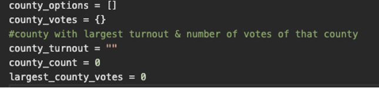

# Election-Analysis 

Overview of Election Audit: Explain the purpose of this election audit analysis.

The purpose of this election audit analysis is to learn the language of Python. By the end of this module, we will be able to create scripts, perform mathematical operations, run comparisons and repetition statements, and produce screen outputs. Using these skills, we will create results of the election in the command line as well as saving them to a text file.

Election-Audit Results: Using a bulleted list, address the following election outcomes. Use images or examples of your code as support where necessary.

•	How many votes were cast in this congressional election? 369,711
•	Provide a breakdown of the number of votes and the percentage of total votes for each county in the precinct. Jefferson received 38,855 votes which made up 10.5% of votes, Denver received 306,055 votes which made up 82.8% of the total, and Arapahoe received 24,801 votes which made up 6.7% of the total.
•	Which county had the largest number of votes? Denver
•	Provide a breakdown of the number of votes and the percentage of the total votes each candidate received. Charles Stockham received 85,213 votes (23%), Diana DeGette received 272,892 votes (73.8%), and Raymon Doane received 11,606 votes (3.1%).
•	Which candidate won the election, what was their vote count, and what was their percentage of the total votes? Diana DeGette won with 272,892 votes (73.8%).
 
  
 
Election-Audit Summary: In a summary statement, provide a business proposal to the election commission on how this script can be used—with some modifications—for any election. Give at least two examples of how this script can be modified to be used for other elections.

This scripts can be modified and used for other elections, for example, if you wanted to change counties to states, initialize state strings and variables. 
 
 

Then you can switch out the county for loops and summary for the states to get the correct output.

  
 
Another modification could be adding the candidate who received the least amount of votes by using the winning candidate’s if statement as a template. Instead of winning_count and winning_percentage it would be losing_count and losing_percentage.

 
 
